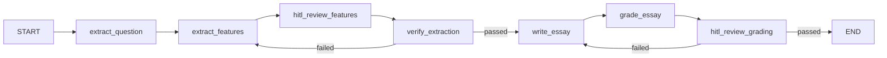

# Plan: Add Human-in-the-Loop (HITL) Nodes to Jihan Pipeline

## Overview

Implement two HITL nodes that pause execution to allow human review and editing of AI outputs, using LangGraph's interrupt mechanism.

## Architecture Changes

### New Workflow Flow




## Implementation Steps

### 1. Create HITL Node Files

**File: `[Jihan/agents/hitl_review_features_node.py](Jihan/agents/hitl_review_features_node.py)`**

- Create a node that interrupts execution before verification
- Display current extracted features to user
- Use `interrupt()` to pause and wait for user input
- Return updated state with user-modified features

**File: `[Jihan/agents/hitl_review_grading_node.py](Jihan/agents/hitl_review_grading_node.py)`**

- Create a node that interrupts execution after grading
- Display current grading feedback to user
- Use `interrupt()` to pause and wait for user input
- Return updated state with user-modified feedback

### 2. Update State Schema

**File: `[Jihan/schemas/state.py](Jihan/schemas/state.py)`**

- Add `human_review_features: Optional[bool]` to track if features were reviewed
- Add `human_review_grading: Optional[bool]` to track if grading was reviewed
- These flags help track human intervention in the workflow

### 3. Update Workflow Graph

**File: `[Jihan/graph/workflow.py](Jihan/graph/workflow.py)`**

Current flow:

```python
builder.add_edge("extract_features", "verify_extraction")
builder.add_edge("write_essay", "grade_essay")
builder.add_conditional_edges("grade_essay", _route_after_grading)
```

Update to:

```python
# Add new HITL nodes
builder.add_node("hitl_review_features", hitl_review_features_node)
builder.add_node("hitl_review_grading", hitl_review_grading_node)

# Update edges
builder.add_edge("extract_features", "hitl_review_features")
builder.add_edge("hitl_review_features", "verify_extraction")
builder.add_edge("write_essay", "grade_essay")
builder.add_edge("grade_essay", "hitl_review_grading")
builder.add_conditional_edges("hitl_review_grading", _route_after_grading)
```

Add `interrupt_before=["hitl_review_features", "hitl_review_grading"]` to compile:

```python
return builder.compile(
    checkpointer=memory, 
    interrupt_before=["hitl_review_features", "hitl_review_grading"]
)
```

### 4. Update Main.py for Interactive Loop

**File: `[Jihan/main.py](Jihan/main.py)`**

Key changes:

- Replace single `stream()` call with a loop that handles interrupts
- After interrupt, prompt user for modifications
- Use `graph.update_state()` to apply user changes
- Resume execution with `graph.stream()` using same config
- Continue until workflow reaches END

Pseudo-code structure:

```python
while True:
    # Stream until interrupt or end
    for chunk in graph.stream(...):
        # Display updates
    
    # Check if workflow is complete
    state = graph.get_state(config)
    if state.next == ():  # No more nodes to execute
        break
    
    # Handle interrupt - prompt user for input
    if "hitl_review_features" in state.next:
        # Display current features
        # Get user modifications
        # Update state with modifications
        graph.update_state(config, updated_values)
    
    elif "hitl_review_grading" in state.next:
        # Display current grading feedback
        # Get user modifications
        # Update state with modifications
        graph.update_state(config, updated_values)
```

### 5. Update Agents Export

**File: `[Jihan/agents/__init__.py](Jihan/agents/__init__.py)`**

- Import and export the two new HITL node functions
- Add to `__all__` list

## Key Technical Details

### LangGraph Interrupt Mechanism

- Use `interrupt()` function from `langgraph.types` inside HITL nodes
- Configure `interrupt_before=[node_names]` in `builder.compile()`
- Check `state.next` to determine which node is waiting
- Use `graph.update_state(config, values)` to modify state during interrupt
- Resume with same config to continue from interrupt point

### User Input Format

For features review:

- Display current: overview, paragraph_1, paragraph_2, grouping_logic
- Accept JSON or structured text input
- Parse and update ExtractedFeatures object

For grading review:

- Display current feedback fields
- Accept modifications to feedback text
- Update GradingFeedback object
- Allow changing `passed` flag to skip revision

### State Management

- `extraction_retry_count` and `grading_retry_count` remain unchanged by HITL
- HITL edits don't count as retries
- Original retry logic still applies after HITL review

## Files to Modify

1. **New**: `Jihan/agents/hitl_review_features_node.py`
2. **New**: `Jihan/agents/hitl_review_grading_node.py`
3. **Update**: `Jihan/schemas/state.py`
4. **Update**: `Jihan/graph/workflow.py`
5. **Update**: `Jihan/main.py`
6. **Update**: `Jihan/agents/__init__.py`

## Testing Strategy

After implementation:

1. Run with test image
2. Verify interrupt occurs after feature extraction
3. Modify features and confirm changes propagate
4. Verify interrupt occurs after grading
5. Modify feedback and confirm essay revision
6. Test "accept as-is" flow (no modifications)

