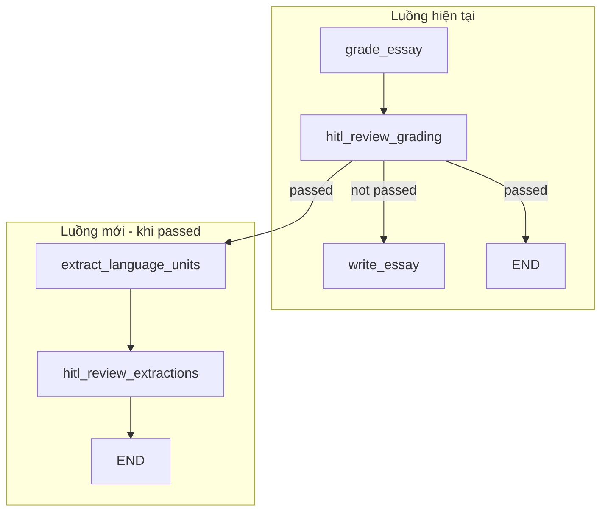
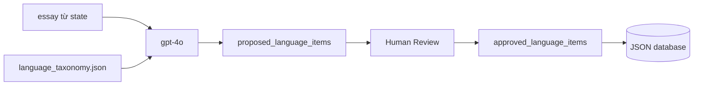

# SubAgent Trích Xuất Đơn Vị Ngôn Ngữ

## Tổng Quan Kiến Trúc




**Thay đổi routing:** Khi `grading_feedback.passed == True`, chuyển từ `END` sang `extract_language_units` thay vì kết thúc ngay.

---

## 1. Cấu Trúc File Taxonomy/Database JSON

Tạo file mẫu tại `Jihan/data/language_taxonomy.json`:

```json
{
  "categories": {
    "trend_description": {
      "description": "Language used to describe change over time in charts or graphs.",
      "allow_subcategory_extension": true,
      "subcategories": [
        "increase",
        "decrease",
        "fluctuation",
        "stability",
        "plateau",
        "peak",
        "bottom",
        "surge",
        "drop",
        "gradual_change",
        "sharp_change"
      ]
    },
    "comparison": {
      "description": "Language used to compare values, categories, or groups.",
      "allow_subcategory_extension": true,
      "subcategories": [
        "higher_than",
        "lower_than",
        "equal_to",
        "similar_to",
        "different_from",
        "ranking",
        "superlative"
      ]
    },
    "data_reference": {
      "description": "Language used to refer to charts, figures, categories, and time points.",
      "allow_subcategory_extension": true,
      "subcategories": [
        "chart_reference",
        "figure_reference",
        "category_reference",
        "time_reference"
      ]
    },
    "quantity_expression": {
      "description": "Language used to describe amounts, percentages, proportions, and numbers.",
      "allow_subcategory_extension": true,
      "subcategories": [
        "percentage",
        "fraction",
        "proportion",
        "majority_minority",
        "approximation",
        "quantity_amount"
      ]
    },
    "sentence_pattern": {
      "description": "Reusable grammatical patterns for Task 1 reporting.",
      "allow_subcategory_extension": true,
      "subcategories": [
        "there_be",
        "comparative",
        "passive",
        "temporal",
        "overview_sentence",
        "trend_sentence"
      ]
    },
    "reporting_function": {
      "description": "Communicative functions specific to IELTS Writing Task 1.",
      "allow_subcategory_extension": true,
      "subcategories": [
        "overview_opening",
        "overview_summary",
        "data_introduction",
        "trend_reporting",
        "comparison_reporting",
        "extreme_reporting"
      ]
    }
  },
  "items": []
}
```

- `categories`: Cố định, LLM chỉ chọn từ các key có sẵn.
- `categories[cat]`: Danh sách subcategory; LLM ưu tiên chọn có sẵn, có thể đề xuất mới nếu cần.
- `items`: Các item đã được duyệt và ghi vào database.

---

## 2. Schema và State

### 2.1 Pydantic model cho mỗi item trích xuất

Trong `[Jihan/schemas/state.py](Jihan/schemas/state.py)`, thêm:

```python
class ExtractedLanguageItem(BaseModel):
    category: str       # Phải nằm trong taxonomy
    subcategory: str    # Có sẵn hoặc đề xuất mới (thuộc category)
    structure: str      # Cấu trúc/pattern (vd: "Sth increased significantly over the period")
    example: str        # Câu ví dụ từ essay

class LanguageExtractionResult(BaseModel):
    items: list[ExtractedLanguageItem]
```

### 2.2 Mở rộng JihanState

Thêm vào `JihanState`:

```python
# Language extraction SubAgent (chạy khi grading passed)
database_path: Optional[str]           # Đường dẫn file JSON
final_generated_essay: Optional[str]   # Essay cuối cùng (copy từ essay)
proposed_language_items: Optional[list[ExtractedLanguageItem]]
approved_language_items: Optional[list[ExtractedLanguageItem]]
human_review_extractions: Optional[bool]
```

---

## 3. Cấu Hình LLM (gpt-4o)

SubAgent phải dùng gpt-4o. Thêm trong `[Jihan/config.py](Jihan/config.py)`:

```python
def get_gpt4o_model(temperature: float = 0.3) -> ChatOpenAI:
    """GPT-4o for language extraction SubAgent (structured output)."""
    return ChatOpenAI(
        model="gpt-4o",
        api_key=os.getenv("OPENAI_API_KEY"),
        temperature=temperature,
    )
```

---

## 4. Node: extract_language_units

Tạo `[Jihan/agents/extract_language_units_agent.py](Jihan/agents/extract_language_units_agent.py)`:

**Input từ state:** `essay`, `database_path`

**Logic:**

1. Đọc taxonomy từ `database_path` (JSON) để lấy categories và subcategories.
2. Gọi LLM với prompt yêu cầu:
  - Chỉ chọn category từ danh sách có sẵn.
  - Ưu tiên subcategory có sẵn; đề xuất mới chỉ khi cần, thuộc đúng category, không trùng nghĩa.
  - Trích structure và example trực tiếp từ essay.
3. Gắn `.with_structured_output(LanguageExtractionResult)`.
4. Return `{"proposed_language_items": result.items, "final_generated_essay": essay}`.

**Nếu `database_path` trống:** Return state không đổi, bỏ qua extraction (hoặc dùng path mặc định).

---

## 5. Node: hitl_review_extractions

Tạo `[Jihan/agents/hitl_review_extractions_node.py](Jihan/agents/hitl_review_extractions_node.py)`:

- Hiển thị `proposed_language_items` qua `writer`.
- Gọi `interrupt()` để chờ người dùng xác nhận.
- Return `{"human_review_extractions": True}` (approved items được cập nhật ở `main.py`).

---

## 6. Cập nhật main.py

Thêm handler cho `hitl_review_extractions`:

```python
elif "hitl_review_extractions" in state.next:
    proposed = state_values.get("proposed_language_items", [])
    # Hiển thị từng item, hỏi approve (y) / reject (n)
    approved = [item for item, keep in zip(proposed, user_choices) if keep]
    # Ghi approved vào file JSON tại database_path
    _append_items_to_database(database_path, approved)
    graph.update_state(config, {
        "approved_language_items": approved,
    }, as_node="hitl_review_extractions")
```

Hàm `_append_items_to_database(path, items)`: load JSON → append vào `items` → save.

---

## 7. Cập nhật Workflow

Trong `[Jihan/graph/workflow.py](Jihan/graph/workflow.py)`:

1. Import: `extract_language_units_node`, `hitl_review_extractions_node`
2. Thêm node: `extract_language_units`, `hitl_review_extractions`
3. Sửa `_route_after_grading`: khi passed → `"extract_language_units"` thay vì `END`
4. Cạnh mới:
  - `extract_language_units` → `hitl_review_extractions`
  - `hitl_review_extractions` → `END`
5. Thêm `"hitl_review_extractions"` vào `interrupt_before`

---

## 8. Điểm Kỹ Thuật Quan Trọng

### Prompt cho LLM (tóm tắt)

- Liệt kê rõ categories và subcategories từ file JSON.
- Instruction: "CHỈ chọn category từ danh sách trên. KHÔNG tạo category mới."
- Instruction: "Subcategory: ưu tiên chọn từ danh sách. Chỉ đề xuất mới nếu không có phù hợp, không trùng nghĩa, và phải thuộc category đã tồn tại."
- Yêu cầu example phải là câu nguyên văn hoặc đoạn ngắn từ essay.

### Human-in-the-loop

1. LLM trích xuất → `proposed_language_items`
2. `hitl_review_extractions` hiển thị từng item
3. Người dùng approve/reject từng item
4. Chỉ approved items được ghi vào JSON qua `_append_items_to_database`

### database_path

- Truyền vào `initial_state` khi gọi `run_jihan_bot` (tham số mới hoặc env).
- Nếu không có: bỏ qua bước extraction và đi thẳng tới END (hoặc dùng default như `./data/language_taxonomy.json`).

---

## 9. Danh Sách File Cần Tạo / Sửa


| File                                           | Hành động                                                             |
| ---------------------------------------------- | --------------------------------------------------------------------- |
| `Jihan/data/language_taxonomy.json`            | Tạo mới – file taxonomy mẫu                                           |
| `Jihan/schemas/state.py`                       | Mở rộng – ExtractedLanguageItem, LanguageExtractionResult, JihanState |
| `Jihan/config.py`                              | Thêm `get_gpt4o_model()`                                              |
| `Jihan/agents/extract_language_units_agent.py` | Tạo mới – node extraction                                             |
| `Jihan/agents/hitl_review_extractions_node.py` | Tạo mới – HITL node                                                   |
| `Jihan/agents/__init__.py`                     | Export 2 node mới                                                     |
| `Jihan/graph/workflow.py`                      | Thêm nodes, sửa routing                                               |
| `Jihan/main.py`                                | Handler HITL, `_append_items_to_database`, truyền `database_path`     |


---

## 10. Luồng Dữ Liệu




