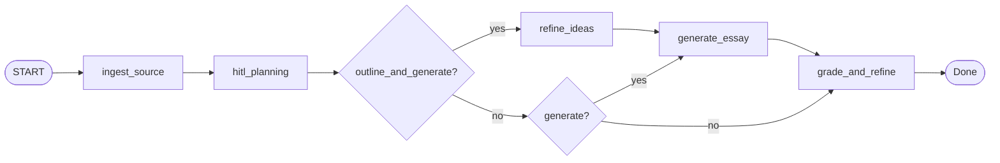

# JihanBot v2

IELTS **Writing Task 1** and **Task 2** in one LangGraph pipeline: ingest prompt (image and/or text), **one HITL planning** step (generate vs grade-only, band, optional outline or user essay), optional **idea refinement**, conditional **essay generation** (regulation-informed, VLM or GPT text model), then **grading and light refinement** with scores and a revised essay that preserves the writer’s stance and content.

## Flow (Mermaid)



- **interrupt_before** only `hitl_planning` (human supplies mode, band, outline/essay via CLI or web).
- **Regulations**: system prompts load `Jihan/regulations/ielts_writing_task_1_regulation.md` or `ielts_writing_task_2_regulation.md` by task type.
- **Models**: image branch uses Together **VLM** (`get_vision_model`); text generation, refinement, and grading use **OpenAI** (`OPENAI_TEXT_MODEL`, default `gpt-5`).

## Project structure

```
Jihan/
├── main.py                 # CLI entry (v2)
├── config.py               # Vision + OpenAI text models
├── requirements.txt
├── pytest.ini
├── tests/                  # pytest (routing + regulations)
├── regulations/            # IELTS grading regulation markdown (injected in agents)
├── graph/
│   └── workflow.py
├── agents/
│   ├── ingest_source_agent.py
│   ├── hitl_planning_node.py
│   ├── refine_ideas_agent.py
│   ├── generate_essay_agent.py
│   └── grade_and_refine_agent.py
├── schemas/
│   └── state.py
├── utils/
│   ├── image.py
│   └── regulations.py
├── data/                   # legacy taxonomy files (unused by v2 graph)
└── webapp/                 # FastAPI + SSE + planning modal
```

## Environment

Create `Jihan/.env`:

| Variable | Purpose |
|----------|---------|
| `TOGETHER_API_KEY` | Vision (Together) for image prompts |
| `TOGETHER_BASE_URL` | Optional; default `https://api.together.xyz/v1` |
| `OPENAI_API_KEY` | Text model for refine, generate (text-only), grade |
| `OPENAI_TEXT_MODEL` | Optional; default `gpt-5` |

## CLI

```bash
cd Jihan
pip install -r requirements.txt

# Task 1, image + optional text
python main.py --task task_1 --image ./chart.png --text "Summarise the chart..." --band 7

# Task 2, text only
python main.py --task task_2 --text-file ./prompt.txt --band 6.5
```

After **ingest**, the CLI prompts for **planning** (generate vs grade-only, band, outline or essay). The graph then runs refine (if applicable), generate (if applicable), and **grade_and_refine**.

## Web demo

```bash
cd Jihan/webapp
pip install -r requirements.txt
uvicorn app:app --reload --host 0.0.0.0
```

Open `http://localhost:8000`. Submit task type, optional prompt text, optional image, then complete the **Planning** modal when the stream pauses.

### API (v2)

| Method | Path | Description |
|--------|------|-------------|
| GET | `/` | Demo UI |
| POST | `/api/run` | Form: `task_type`, `band_score`, `prompt_text`, optional `image` |
| GET | `/api/stream/{thread_id}` | SSE: `thinking`, `interrupt`, `done` |
| POST | `/api/hitl/planning` | Form: `thread_id`, `user_mode` (`generate` \| `grade_only`), `target_band`, `user_outline`, `user_essay` |

## Tests

```bash
cd Jihan
pip install -r requirements.txt
pytest tests/ -q
```

## State (summary)

`JihanState` holds `task_type`, `prompt_kind`, `source_image_path`, `source_prompt_text`, HITL fields (`user_mode`, `target_band`, `user_outline`, `user_essay`), pipeline fields (`refined_brief`, `generated_essay`, `essay_under_review`), and `grading_output` (`GradingAndRefinementResult`).
