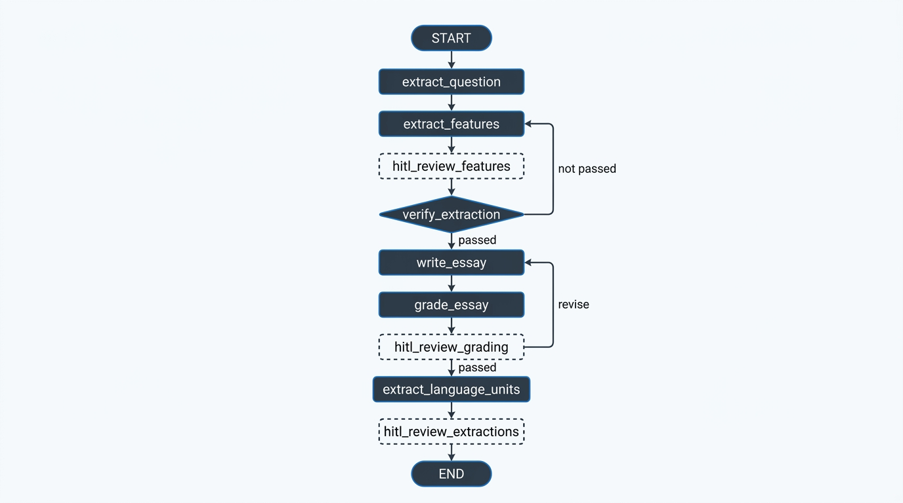
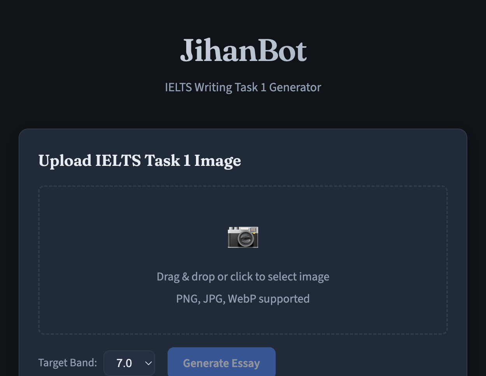

# JihanBot

Pipeline sinh bài IELTS Writing Task 1 từ hình ảnh đề bài, dùng LangGraph với HITL (Human-in-the-Loop) và kho lưu cấu trúc ngôn ngữ.

## Pipeline



---

## Cấu trúc project

```
Jihan/
├── pipeline-diagram.png # Sơ đồ luồng pipeline
├── main.py              # CLI entry point
├── config.py            # Model config (vision + text)
├── graph/
│   └── workflow.py      # Định nghĩa graph và routing
├── agents/               # Các node xử lý
│   ├── extract_question_agent.py
│   ├── extract_features_agent.py
│   ├── verify_extraction_agent.py
│   ├── write_essay_agent.py
│   ├── grade_essay_agent.py
│   ├── extract_language_units_agent.py
│   ├── hitl_review_features_node.py
│   ├── hitl_review_grading_node.py
│   └── hitl_review_extractions_node.py
├── schemas/
│   └── state.py
├── data/
│   ├── language_taxonomy.json
│   └── language_items.json
├── utils/
│   └── image.py
└── webapp/               # Giao diện web demo
    ├── app.py           # FastAPI (SSE, HITL API)
    ├── requirements.txt
    ├── screenshot.png
    ├── static/
    │   ├── index.html
    │   ├── styles.css
    │   └── app.js
    └── uploads/
```

---

## Chạy CLI

```bash
cd Jihan
pip install -r requirements.txt
```

Copy `.env.example` → `.env`, điền `TOGETHER_API_KEY` và `OPENAI_API_KEY`.

```bash
python main.py <đường_dẫn_ảnh> [band_score]
```

Ví dụ:

```bash
python main.py ./image.png 7
python main.py ./task1_chart.png 7.5
```

---

## Web Demo



Giao diện web: upload ảnh, xem thinking stream, nhận essay, review HITL, lưu cấu trúc vào gallery.

### Giao diện

| Khu vực | Mô tả |
|---------|-------|
| **Upload** | Drag & drop ảnh, chọn band 6.0–8.5, nút Generate Essay |
| **Thinking** | Log streaming trạng thái: idle → thinking... → paused → done |
| **Final Essay** | Bài essay sau khi pipeline xong |
| **Proposed Language Units** | Nút Review → Edit, Approve, Reject từng item → Save Approved |
| **Language Gallery** | Nút Open → Grid cards (category, structure, example), filter, Close |

### Thiết kế

- Dark mode (#0f1419, #1e2a3a), accent xanh (#3b82f6)
- Font: Fraunces, Source Sans 3, JetBrains Mono

### Chạy

```bash
cd Jihan/webapp
pip install -r requirements.txt
uvicorn app:app --reload --host 0.0.0.0
```

Mở http://localhost:8000

### API

| Method | Path | Mô tả |
|--------|------|-------|
| GET | / | Trang chủ |
| GET | /api/gallery | Items + taxonomy |
| POST | /api/run | Upload ảnh, trả thread_id |
| GET | /api/stream/{thread_id} | SSE thinking |
| POST | /api/hitl/features | Submit features |
| POST | /api/hitl/grading | Submit grading |
| POST | /api/hitl/extractions | Submit approved items |

---

## Models

| Vai trò | Model | Provider |
|---------|-------|----------|
| Vision | Qwen/Qwen3-VL-8B-Instruct | Together |
| Text (viết, chấm) | Llama-4-Maverick-17B-128E-Instruct | Together |
| Language extraction | gpt-4o | OpenAI |

Đổi text model qua `TOGETHER_TEXT_MODEL`. Dùng OpenAI cho text: `USE_TOGETHER_FOR_TEXT=false`.
