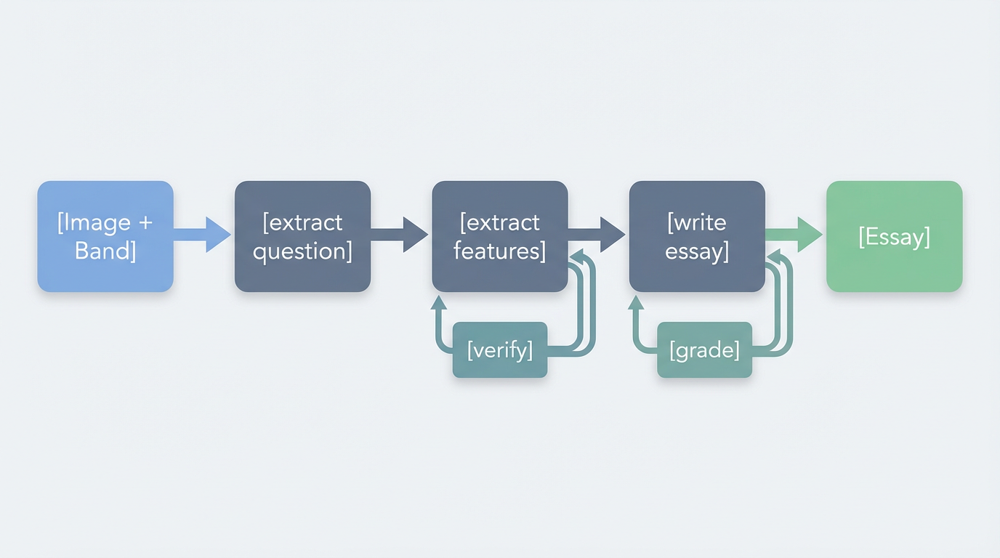

# JihanBot

Pipeline sinh bài IELTS Writing Task 1 từ hình ảnh đề bài, sử dụng LangGraph để điều khiển luồng xử lý có điều kiện và retry.



## Tổng quan

JihanBot nhận ảnh chụp đề IELTS Task 1 (biểu đồ, bảng số liệu, quy trình) và band điểm mục tiêu, sau đó tự động:

1. Trích xuất nội dung đề bài từ ảnh
2. Phân tích và lấy cấu trúc dữ liệu (overview, các đoạn chi tiết)
3. Đối chiếu với ảnh gốc, retry tối đa 3 lần nếu sai
4. Viết bài theo band đã chọn
5. Chấm điểm theo tiêu chí IELTS, revise tối đa 3 lần nếu chưa đạt

Pipeline dùng LangGraph với conditional routing và state để xử lý các vòng lặp verify/grading một cách rõ ràng.

## Cấu trúc project

```
Jihan/
├── main.py           # Entry point
├── config.py         # Model config (vision + text)
├── graph/
│   └── workflow.py   # Định nghĩa graph và routing
├── agents/           # Các node xử lý
│   ├── extract_question_agent.py
│   ├── extract_features_agent.py
│   ├── verify_extraction_agent.py
│   ├── write_essay_agent.py
│   └── grade_essay_agent.py
├── schemas/
│   └── state.py     # JihanState
└── utils/
    └── image.py     # Load ảnh base64
```

## Cài đặt

```bash
cd Jihan
pip install -r requirements.txt
```

Copy `.env.example` thành `.env`, điền `TOGETHER_API_KEY`. Mặc định dùng Together cho cả vision và text; nếu muốn dùng OpenAI cho phần viết bài thì set `USE_TOGETHER_FOR_TEXT=false` và khai báo `OPENAI_API_KEY`.

## Chạy

```bash
python main.py <đường_dẫn_ảnh> [band_score]
```

Ví dụ:

```bash
python main.py ./image.png 7
python main.py ./task1_chart.png 7.5
```

Band mặc định là 7 nếu không truyền.

## Models

| Vai trò | Model | Provider |
|---------|-------|----------|
| Vision (OCR, đọc biểu đồ) | Qwen/Qwen3-VL-8B-Instruct | Together |
| Text (viết, chấm bài) | Llama-4-Maverick-17B-128E-Instruct | Together |

Có thể đổi text model qua biến `TOGETHER_TEXT_MODEL` trong `.env`.
